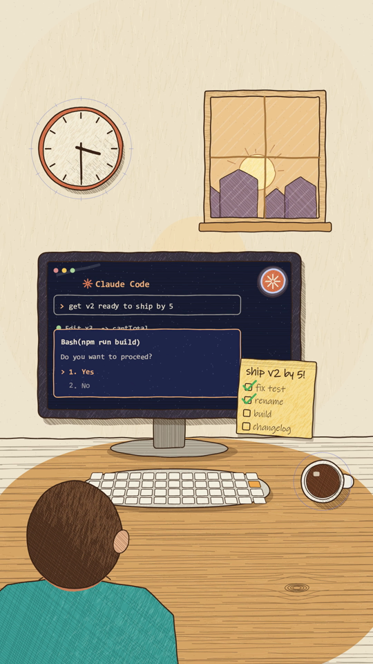

# Crosshatch ink

A sketchy ink line that boils on 2s, crosshatch and coloured-pencil shading clipped inside shapes, stipple, paper grain. Warm cream paper and wood by day; navy "inside the computer" worlds with periwinkle lines and glowing accents.

## Palette

`C` in `kit/core.js`. Day: ink `#3a2417`, paper `#f4ecd9`, cream `#efe5cf`, wood `#d6a466`, yellow `#f0c55a`, green `#5f9c5c`, red `#d4382c`, sky `#9cc4d6`, rose `#d98b8b`. Night: navy `#0c0d1c` / `#15173a`, periwinkle `#c8d0f0`, cyan `#52d6c4`, magenta `#e0368f`, glow green `#5de37a`. **Terracotta `#d97757` is the hero** (the ink dot); red pencil dashes `rgba(212,56,44,0.92)` mean a plan.

## The medium

- `ink(points, { w, color, amt, key, frac, double })`: a wobbly stroke reseeded every boil step; `frac` writes it on.
- `paint(points, { fill, w, line, tex: [...] })`: fill, then textures clipped inside — `hatch` (angle, gap, dash, `dens(x, y)`), `cross`, `pencil` (coloured-pencil strokes), `stipple` — then the ink outline.
- Shade with a density function (`dens: (x, y) => 0..1`) rather than flat fills: light from the top-left, darker toward the bottom-right.
- `grain()` over every frame (`STYLE.post`).

## Motion habits

- On 2s: lines boil (re-wobble) every 2 frames even in held shots — the drawing is alive when nothing moves.
- Write-ons (`frac`) for lines, plans and handwriting; `monoText(..., { count })` types code.
- Beat-cut pieces: 120 BPM at 24fps, cuts on 8ths, 16ths in the rush; iris in/out (`irisHole`) into the dark world.
- Dark close-ups on 9:16 need ~1.2× zoom to fill the phone-safe area.

## Frame checklist (on top of grammar/FRAME.md)

1. **Every filled shape has a texture** (hatch, cross, pencil or stipple) shaped by light — no flat fills except paper.
2. **The line boils** — never a perfectly still stroke in a held frame.
3. **Tool-call pills (`toolPill('Read', 'notes.md', …)`) make agent steps readable** — and must be true.
4. **The dark world and the paper world look different on a contact sheet:** navy + periwinkle lines inside the machine, cream + ink outside.
5. **The hero dot keeps its terracotta and asterisk** in both worlds (it gets a glow in the dark).
6. **World-anchored textures** when the camera pans (texture keys don't depend on screen position).

## Kit API

`kit/core.js`: `ink`, `paint`, `hatch`, `pencil`, `stipple`, `wobble`, `grain`, `construct`, `ruler`, `sparkBurst`, `burst`, `star4`, `rainbow`, `hexGrid`, `irisRim`, `irisHole`, `camera`, `monoText`, `monoW`, `handwrite`, `drawPencil`, `asterisk`, `C`.
`styles/crosshatch/kit.js`: `paperSheet`, `woodSurface`, `darkWorld`, `stripedCloth`, `inkMug`, `toolPill`, `planInk`, `dotHero(x, y, r, { dark, mood })`, `inkCard`, `inkTag`, `inkCaption`, `handText`, `handW`, `box`.

## Do / don't

- **Do** keep a plan (red dashes) separate from the doing (ink); show the plan first, then the same thing done for real.
- **Don't** use `paint()`/`hatch()` to fade a prop: they reset `globalAlpha`. Skip the prop instead.

## Proven on

Several Claude Code explainers (a 32s deadline mission, a 24s subagent story, a 13s life-of-a-prompt) and `demo/` (6s: a desk by morning; the coffee becomes the moon over the machine).
