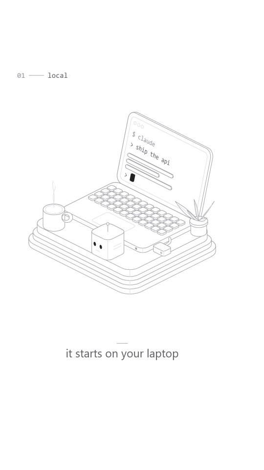

# Isometric line art

Calm, precise product illustration: objects in 2:1 dimetric isometric on a white ground, drawn only with constant hairlines. Grey silhouettes and edges, lighter inner and receding lines, faces filled white so nearer objects hide farther lines. Rounded slabs and plates with visible thickness, stacked layers, grids of repeated parts (keys, vents, pillars, ports), and one tiny dark accent per frame. Motion on 1s with spring settles; otherwise still. Studied from MIT-licensed isometric line figures (references kept local, never copied).

## Measured (from the reference figures' live SVG, and screenshots of them)

| what | reference | this style |
|---|---|---|
| ground | `#ffffff` (screenshot palette: the 248 bucket, 95-99% of pixels) | `#ffffff`; 97% of a frame |
| silhouette / edges | `rgb(164,164,172)`, 0.9px non-scaling | `#a4a4ac` (= 164,164,172), **2.0px at 1080 wide** |
| inner / receding lines | `rgb(224,224,228)`, 0.9px | `#e0e0e4`, 2.0px (same weight, lighter colour) |
| faces | filled `#fff` | filled `PAL.face` (white) |
| accent | `rgb(35,35,39)`, one element per figure | `#232327`; one focus per frame (plus the hero's eyes) |
| projection | 2:1 dimetric, edges slope 0.5 (26.57°) | same: x → (u, u/2), y → (−u, u/2), z → (0, −1.2247u) |
| slab thickness | ~7 units on a 400-unit viewBox (1.75%) | 9-22 world units on ~420-unit objects (2-5%) |
| corners | rounded / chamfered, radius ~5-10% of the slab | `r` 10-44 (about 5-10% of the slab's long side) |
| line : figure width | 0.9px on a ~480px figure ≈ 0.19% | 2.0px on a ~800px figure ≈ 0.25% (see Not matched) |
| figure : frame width | ~34% (a gallery view) | ~75-80% of 1080 (a phone frame) |
| shadows, texture, grain | none | none |

Palette as `compare.mjs` buckets (crop of the terminal figure vs our t=2.35s): ref 248 96.2% · 232 2.6% · 216 0.9%; ours 248 97.1% · 168 1.0% · 232 0.5%. The reference's hairlines land in the 216-232 buckets only because the 0.9px lines were downsampled to ~0.5px in the screenshot; the SVG says 164 and 224.

## Palette and meaning (`PAL` in kit.js)

- `paper` / `face` `#ffffff` — the ground and every face. White fills do the hidden-line work.
- `edge` `#a4a4ac` — silhouettes, the cap facing the viewer, sharp edges, cables, hero outline.
- `inner` `#e0e0e4` — receding and inner lines: rounded-corner creases, bezels, vents, trackpad, steam, contact rings.
- `accent` `#232327` — the focus: the cursor, the active blade's LED. One per frame. The hero's two eyes use it too.
- `text` `#5c5c64`, `textD` `#9a9aa2` — captions, labels, typed mono.
- **Dark variant** (`const ISO_DARK = true;` before the kit, see `demo-dark/`): ground and faces `#101014`, edge `#8e8e9a`, inner `#34343c`, accent `#f4f4f6` (the focus becomes the brightest thing), text `#b4b4be`.

## Line and geometry

- Hairlines are **constant on screen**: `hair(color)` divides the width by the current transform's scale, so a camera push never thickens a line. Round joins and caps. No wobble, no boil.
- Every edge lies on an iso axis (x, y or z) unless something is rotating (a lid on its hinge, a leaf).
- A solid is a rounded rectangle extruded along an axis (`isoSlab`): white silhouette fill, silhouette stroke, the front cap's outline, and **one** extrusion line at the corner nearest the viewer (`inner` when the corner is rounded, `edge` when sharp).
- Hidden lines by painter's order: back to front (smaller x + y first; lower z first in a stack; a thing pulled forward is still drawn in its stack slot, and whatever rides on it is drawn last).
- Type: sans for captions (`"Segoe UI", "Helvetica Neue", Arial, sans-serif`, 46px, centred at `CX`, a 44px rule above), mono for tags and labels (`Consolas, Menlo, "DejaVu Sans Mono", monospace`). Labels on objects are set into the face (`isoText` skews the glyphs into the plane).

## Motion habits

- On 1s (`ones: true`): motion is smooth; nothing boils. Held frames are truly still apart from tiny idle life (the hero's bob, a lamp toggling once a second, steam, a leaf sway).
- Every move settles on a spring: `spring(t, t0, { k, damp })` (closed form, no state). Things **drop in** (plates, props: `1 - spring` times a height), **rise** (keys in a diagonal wave, `(i + j) * 0.028` s apart), **open** (a lid on its hinge), **slide** (a blade out of a rack, k 55, damp 0.72). `kick()` for squash and antenna sway.
- Stagger reveals along the iso diagonal; never all at once.
- Camera: still, or a slow push of a few percent (z ≤ 1.05). No shake, no zoom bumps.
- Morphs: the renderer's shape morph works on 2D outlines; give it a face outline (`facePts`) on both sides so the morphing shape lies in the same plane in both eras.

## Frame checklist (on top of the skill's grammar/FRAME.md)

1. **Every edge sits on an iso axis** (slope ±0.5 or vertical), except a part that is visibly rotating.
2. **Hairlines are constant** at any zoom and the same weight everywhere (2.0px at 1080); only the colour changes (edge vs inner).
3. **Nearer faces are white and hide what is behind** — no line shows through a solid; check the painter's order wherever two objects overlap on screen.
4. **One dark accent, and it is the focus** (the cursor, the live LED). Other lamps toggle between outline and grey, never dark.
5. **Detail comes from repetition** — a grid of keys, vents, ports, plates — not from texture or shading. Big faces stay empty.
6. **Slabs have thickness and rounded corners**, and stacks show their layers (a gap or an inset between plates).
7. **White space around the object** is part of the look: one object group in the middle, the caption well below it, nothing touching the frame edge.
8. **Every move settles on a spring** and then holds still.
9. No shadows, gradients, grain or colour.

## Kit API (`kit.js`, on top of `kit/core.js`)

- Projection: `setIso({ ox, oy, u })`, `iso(x, y, z)`, `isoP([x, y, z])`, `ZK`, `ISO_VIEW`, vectors `vadd vsub vsc vdot vcross`.
- Lines: `hair(color, w)`, `polyPath(P, closed)`, `line3(P3, color)`, `hull2(P)`, `zoomNow()`.
- Solids: `isoSlab(o, a, b, n, w, d, h, { r, seg, fill, edge, crease, creaseC })` → `{ front, at(u, v, s) }`; `isoBox(x, y, z, w, d, h, o)`; `isoPanelY` / `isoPanelX` (standing panels); `isoCyl(x, y, z, r, h)`; `isoPlates(x, y, z, w, d, [{ h, gap, inset, r, dz }])`; `isoGrid(nx, ny, fn(i, j))` (painter's order).
- Faces (u right, v down): `faceOf(origin, a, b)`, `slabFace(slab)`, `facePath`, `faceRR(fp, x, y, w, h, r, { fill, stroke })`, `faceEll`, `faceLine`, `faceSlab(fp, x, y, w, h, t, o)` (a raised pill / key / button), `facePts` (outlines for bridges), `isoText(fp, str, u, v, size, { color, count, font })`, `accentDot(fp, u, v, r)`, `lamp(fp, u, v, r, lit)`.
- Motion: `spring(t, t0, { k, damp })`, `kick(t, t0, { k, damp })`, `springTo`, `blinkOn(t, period, phase)`.
- Props: `isoMug(x, y, z, r, h)`, `isoPlant(x, y, z, s)`, `isoCable(P3, { w })`.
- Hero: `cubeBot(x, y, z, s, { key, hop, look, faceX })` — a rounded cube with two accent-dark eyes that blink, a mouth line, an antenna that sways after a hop, an idle bob, a contact ring while airborne; sets `SPARK_AT`.
- Captions: `isoCaption(str)`, `isoTag(num, label)` (through `DEFER`).
- `STYLE`: `paper`, `backdrop` (flat fill), `window` (the source seen through the outline with a hairline rim and a light thickness line under it), `blob` (a hairline slab; its fill goes from accent-dark to white as the stroke colour goes from accent to edge, so a dark cursor can become a white panel), `hero`, `heroColor`, `heroPts`, `post` (nothing), `ones: true`.

## Do / don't

- **Do** design in world units (≈ px with `u` ≈ 1) and lay out each era's group so its silhouette spans ~75-80% of the frame width.
- **Do** put text and small parts *on faces* (`faceOf`, `slabFace`) so they skew with the object.
- **Do** draw riders (the hero on a blade) after everything they sit in front of.
- **Don't** stroke inside a skewed face transform (the width skews too); project points and stroke in world space (all `face*` helpers do).
- **Don't** add a second dark element to show emphasis; move the accent instead.
- **Don't** use non-convex outlines with `isoSlab` (it fills the convex hull); build an L-shape from two slabs.

## Not matched (deliberate or open)

- **Line lightness as seen:** the reference screenshots read lighter (their 0.9px lines downsample to 216-232 grey); at 2.0px we draw the true SVG colours, so our frames read about one grey step darker. Deliberate: thinner or lighter lines vanish on a phone after compression.
- **Line-to-figure ratio** 0.25% vs 0.19%, for the same reason.
- **Scale:** the subject fills ~75-80% of the frame width (the reference gallery shows ~34%).
- **Bevels:** the reference often doubles slab edges with an inset parallel line (a bevel); we draw one cap outline. Add a `faceRR` inset by hand where wanted.
- **Type:** the reference figures carry no type; we add mono labels set into faces and a sans caption.
- **Non-convex plates** (L-shaped floors) are not a primitive.
- **The morph's in-between** pinches when a tiny shape becomes a long thin one (the renderer resamples by angle) — the references don't morph at all.

## Proven on

`demo/` (6s, 9:16, 120 BPM, 24fps): a laptop on a stacked plinth drops in, opens on a spring, its keys rise in a wave and a prompt is typed; the dark cursor block morphs at 3.0s into the front of a server blade, which slides out of a rack with the cube-bot riding it. Tile deterministic; `demo-dark/` renders the same piece on the dark ground.
