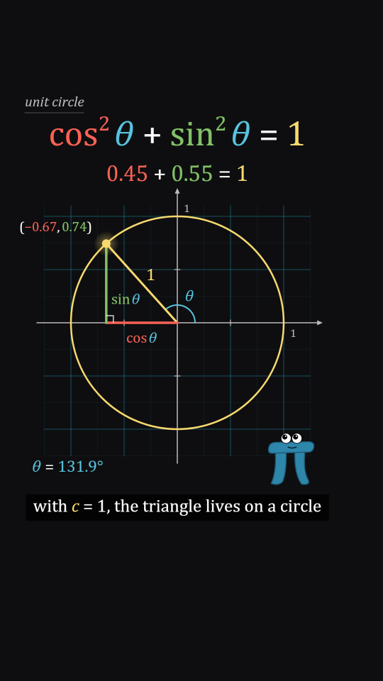

# Math

A manim-style math explainer look. Coloured math on a near-black stage:
- serif type that is **Written** on
- axes, number planes and graphs that **ShowCreation** sweeps draw
- equations and shapes that **Transform** into each other
- a tracking dot with a live decimal readout
- a small pi-shaped hero with eyes that watches the math happen

The motion is smooth, on 1s, and eased with manim's sigmoid `smooth`. Nothing boils and there's no texture or grain. It's clean vector strokes, so the colour coding does the work.

Use it when the subject is an idea with a picture: a formula, a proof, a function, a rate, a geometric fact. The look promises rigour, so it only works when the math on screen is true.

## Palette

These are manim's colour constants (`MC.*` in the kit). Most colours carry meaning: **give each quantity one colour and keep it everywhere**: in the formula, on the figure, in the labels, in the readouts and in the captions.

| key | value | use |
|---|---|---|
| `bg` | `#0E0E10` | the stage (and `STYLE.paper`). Near-black, flat |
| `white` | `#FFFFFF` | operators (`+ = ( )`), neutral text |
| `grey` / `greyC` / `greyD` | `#BBBBBB` / `#888888` / `#444444` | axes and ticks / secondary labels, tags / underlines, guides |
| `blueD` | `#29ABCA` | number-plane lines only (at 14–42% alpha) |
| `red` | `#FC6255` | quantity 1 (demo: `a`, `cos θ`) |
| `green` | `#83C167` | quantity 2 (demo: `b`, `sin θ`) |
| `yellow` | `#F7D96F` | quantity 3, often the result or the "whole" (demo: `c`, `1`, the circle, the tracking dot) |
| `blue` | `#58C4DD` | quantity 4, often the angle or the parameter (demo: `θ`) |
| `teal` / `gold` / `purple` / `maroon` / `pink` / `orange` | `#5CD0B3` / `#F0AC5F` / `#9A72AC` / `#C55F73` / `#D147BD` / `#FF862F` | more quantities, when a piece needs them |
| `yellowP` | `#FFFF00` | pure yellow, for Flash only |
| `pi` / `piD` | `#2E86AB` / `#1C5A75` | the hero's body and edge (never a quantity's colour) |

Fills are the stroke colour at 14–35% alpha (manim's `fill_opacity`). Captions sit on a black BackgroundRectangle at 75% alpha.

## Type

- **Serif for all math and prose:** `Cambria, "Cambria Math", "Latin Modern Roman", "CMU Serif", "STIX Two Text", "Times New Roman", Georgia, serif` (`MATH_SERIF`). Cambria comes first because it has a real italic; Cambria Math has none, so the browser would fake it.
- **Mono for code:** `Consolas, Menlo, "DejaVu Sans Mono", "Courier New", monospace` (`MATH_MONO`).
- **TeX conventions:**
  - variables are italic (`mv`)
  - digits, function names (`cos`, `sin`, `log`) and units are upright (`mn`)
  - binary operators and relations get TeX's spacing (automatic in `texLayout`)
  - superscripts are at 0.6 size
  - use a true minus `−` (`fmtNum` does this)
- **Sizes at 1080×1920:**
  - the main formula: 90–110px
  - a second line: 60–70px
  - labels on a figure: 40–52px
  - tick labels: 28–32px
  - captions: 50px
  - nothing under 28px

## Motion habits

- **On 1s** (`STYLE.ones = true`): TT advances every frame. Easing is manim's `smooth` (`smoothM`, a sigmoid with inflection 10) or `thereBack` for Indicate / hop moves. Never linear, except a value that a tracker drives.
- **Run times about 1s:** Write 0.7–1.0s, ShowCreation 0.5–1.0s, Transform 0.8–1.0s, FadeIn 0.3–0.5s, Flash 0.4–0.5s. `runS(t0, d)` is a `play(..., run_time=d)` starting at `t0`.
- **Lag ratios (LaggedStart):** about 1.2–1.4 across the glyphs of a Write, and 0.5 across sibling objects. Use `lagged(p, i, n, 0.5)` for the three squares or three sides.
- **Write:** the outline draws on over each glyph's first half, the fill fades in over its second half, lagged left to right. Formulas are Written, not typed, and they never pop.
- **ShowCreation:**
  - a line, an arc or an axis sweeps from its start
  - a closed shape draws its border, then the fill fades up (DrawBorderThenFill)
  - axes come before ticks, and ticks before labels
- **Transform:** an equation turns into the next one by matching terms (`transformTex`, ids). Terms that stay glide to their new place. Terms that change cross-fade while they move. A shape turns into a shape (`STYLE.blob`, the morph bridge).
- **Trackers:**
  - a value moves smoothly (`keysM`)
  - the dot, the drop lines and the readouts are recomputed from it every frame
  - the readout shows the honest value at its precision
- **The camera stays still.** If you need a zoom, make it one slow, eased push.
- **Formats:**
  - **9:16** (1080×1920, 24fps, 120 BPM): the 8th grid is 6 frames.
  - **Native b-roll** is 16:9 at 60fps (1920×1080). At 120 BPM an 8th is exactly 15 frames, so cuts land on whole frames. A 16th would be 7.5 frames, so stay on 8ths.

## Frame checklist

Check every key frame against this before you call it done:

1. **One idea per frame.** A frame shows one step of the argument: one formula being Written, one figure being built, or one Transform. If two things are animating, they're the same step in two forms, like the equation and its picture.
2. **Colour-coded variables are consistent.** Every quantity has exactly one colour, and it's the same in the formula, on the figure, in labels, in readouts and in captions. The hero's blue and the grey guides are never a quantity's colour. A term that changes identity (`a` → `cos θ`) keeps its colour through the Transform.
3. **The equation and the picture agree.**
   - The numbers on screen are the numbers the figure shows: 16 cells in the square on 4, and a readout computed from the same tracker as the dot.
   - Rounded values must still add up as displayed.
   - If a claim isn't exactly true at the shown precision, change what you show.
4. **The text is real math, typeset cleanly.**
   - italic variables, upright functions and digits
   - TeX spacing round operators, a true minus sign
   - superscripts raised and smaller
   - no label crossing a stroke, and no label crossing another label
   - labels sit on the side of a segment away from the figure, and fade when their segment gets too short
5. **Motion explains.** Every move maps to a step of the argument: drawing a side defines it, a square appearing is "squaring", a Transform is a substitution, a sweep is "for every θ". Decorative motion is limited to the hero (blink, hop) and the Flash on the result.
6. **Safe area and breathing room.** Everything sits inside x 60–940, y 250–1500 on 9:16. The formula stays at the top, the figure in the middle, readouts low left, the hero low right, and the caption at y 1440.
7. **Background life is quiet.** Use a faint number plane, tick marks, unit cells, a right-angle mark, a section tag or a coordinate label. Use three or more, all low-contrast and all true.

## Kit API (`styles/math/kit.js`, on top of `kit/core.js`)

- **Easing / time:**
  - `smoothM(u)`, `thereBack(u)`
  - `runS(t0, d)`: smooth progress of a play at t0
  - `lagged(p, i, n, lag)`
  - `keysM([[t, v], ...])`: a smooth keyframed value
  - `fmtNum(v, d)`
- **Text:**
  - `writeText(segs, x, y, size, p, { align, color, it, lag, alpha })`: segs = string or `[{ s, c, it }]`
  - `mText(...)`: already written
  - `writeGlyph`, `textW`
- **Formulas:**
  - tokens `mv(s, c, { sup, sub, id })` (italic) and `mn(...)` (upright), operator strings `'+'`, `'='`, `'−'`, fractions `{ frac: [num, den], c }`, spaces `{ sp: em }`
  - `writeTex(tokens, x, y, size, p, o)` returns the screen layout
  - `texBox(layout, id)`: the box of a term (for a Flash, brace or arrow)
  - `transformTex(A, B, x, y, size, u)`: TransformMatchingTex by token id
- **Strokes:**
  - `segLine(x1, y1, x2, y2, c, w, p, al)`
  - `showCreation(P, p, { c, w, closed, fill })`
  - `mArrow(x1, y1, x2, y2, c, w, p)`
  - `mBrace(x1, y1, x2, y2, { side, label, p })`
  - `rightAngle(x, y, d1, d2, s)`
  - `angleArc(x, y, r, a0, a1, c, p)`
  - `squareOn(x1, y1, x2, y2, side)`, `cellGrid(Q, n, c, al)`
  - `polyPath(P)`
  - `flashAt(x, y, u, c, r)`
  - `indicateS(u)`
- **Plots:**
  - `axes2({ at, u, x, y, ext, step, tick, labels, p })` returns `{ to(x, y), ... }`
  - `numberPlane(A, { step, sub, p })`
  - `graphM(A, f, x0, x1, p, { c, w, area })`
  - `dropLines(A, x, y)`
- **Trackers:**
  - `trackDot(x, y, c)`
  - `readout(label, v, d, x, y, size, { c, align, p })`: writes `label = value`
- **Hero:** `piHero(x, y, s, { look: [x, y], mood: 'calm' | 'wow' | 'happy', hop, key })`. Feet at (x, y). Sets `SPARK_AT`. It blinks on its own, deterministically.
- **Overlays (DEFER):**
  - `mathCaption(segs)`: a written caption on a BackgroundRectangle at (CX, 1440)
  - `mathTag(str)`: a grey italic section tag, top left
- **STYLE:**
  - `paper` is the stage colour, and `backdrop(c)` is a flat fill
  - `window` shows the world through the bridge outline, rimmed in the bridge shape's own colour
  - `blob` is a coloured stroke over a 32% fill (the Transform look)
  - `hero` and `heroPts` give the pi hero for hero-to-hero bridges
  - `ones: true`, and there's no post pass
- **Needs from the head:** `CX` (caption centre x). `HAND` is only used by the storyboard title, so set it to the serif stack.

## Do / don't

- **Do** write the colour code down first (quantity → colour), then use it everywhere, captions included.
- **Do** build the figure in the order of the argument: sides, then squares, then cells, then the count, then the sum.
- **Do** compute every readout from the same tracker that moves the picture. Round so the displayed arithmetic is exact. The demo shows `sin²` as `1 − round(cos²)`.
- **Do** bridge eras with a shape that *is* the next idea: the square on c becomes the circle of radius c.
- **Don't** use grain, wobble, boil, drop shadows, gradients behind math, or textures. This is the one clean style.
- **Don't** use pure `#FFFF00` for anything but a Flash. Don't use pure black for the stage.
- **Don't** let a label sit on a stroke. Don't let tick labels sit where a curve crosses the axis.
- **Don't** pop formulas in, and don't type them like a terminal. Write them.
- **Don't** state anything the math doesn't support, even in a caption.

## Proven on

Two short math explainers (20s and 30s, 16:9 at 60fps), and this demo (6s 9:16):
- `a² + b² = c²` drawn as a 4-3-5 triangle with 16 + 9 = 25 unit cells
- the square on c morphs into the unit circle
- the formula Transforms to `cos²θ + sin²θ = 1` while a live readout keeps summing to 1
