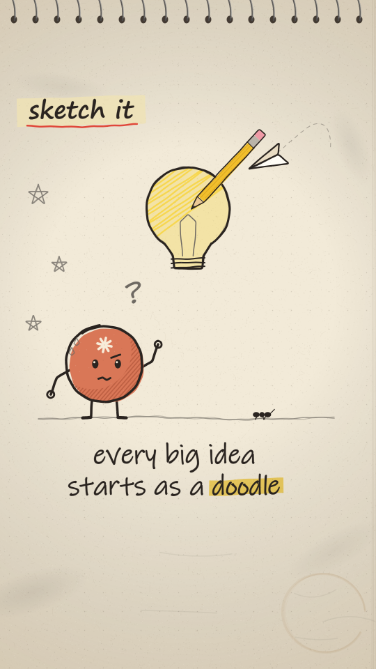

# Sketchbook

Graphite and one accent colour on a warm sketchbook page. Every line is drawn by hand and boils on 2s. Things get **pencilled in, inked over, then coloured with a quick scribble**, and hand lettering on the page does the narrating. The page is the world: its dot grid, spiral binding, smudges and coffee ring stay in view, and the camera moves across the page instead of cutting away from it.

## Palette (`SK` in kit.js)

| role | value | use |
|---|---|---|
| paper | `#f2ead8` | the page; also the blank sheet a morph happens on |
| ink | `#2a2420` | settled lines, lettering, eyes |
| graphite | `#6f6a63` (light `#9a948b`) | construction lines, the mess, hatching, things not settled yet |
| **accent: terracotta** | `#d97757` (shade `#b85c3f`) | the hero, and only the hero |
| highlighter | `#f7d64a` | the one word to read; one glowing object (a bulb, the sun) |
| red marker | `#e0483a` | a title underline or a stamp, once per scene |
| green | `#4f9d5d` | a check mark (done / correct) |
| prop colours | pencil `#f1bf2c`, wood `#ecc995`, eraser `#ef9aa6`, tape `#efe2b4`, card `#fffdf6` | real objects on the desk keep their own colours, kept small |

## Line and texture

- **Two pens.** `gline` is ink: one confident stroke plus a thin second pass that doesn't quite agree. `gpencil` is graphite: two light, looser passes. Use graphite for anything provisional and ink once it's decided.
- **The boil.** The wobble's phases reseed on every boil step (`B`), and it's index-based, so the tremor travels along the stroke. Structure (where a scribble goes, how long a hatch line runs) is seeded by key and never moves. Only the tremor changes.
- **Colour sits off the line.** `gfill` lays a flat colour a few pixels off the ink, the way a quick colour pass misses the outline.
- **Shading is hatching,** never a gradient. `ghatch` goes inside a clip, and `litHatch` shades a round thing but leaves a lit circle top-left.
- **Colour is a scribble.** `scribbleFill` shades a shape in one colour with a back-and-forth stroke, over a faint wash. It can write on.
- **The page** (`sketchPage`) is built once from a seeded RNG and cached: tooth specks, fibres, a vignette, a dot grid (or `ruled`), graphite smudges, ghosts of erased lines, a coffee ring, the edges of the pages below, and a spiral binding along the top. `post()` adds faint grain that boils on top.
- **Overshoot.** `loopPts` circles run past their start and drift outward. `sketchBox` boxes end a little past the corner they began at.

## Lettering

- Local system fonts only. Hand: `"Ink Free", "Segoe Print", "Bradley Hand", "Comic Sans MS", "Chalkboard SE", cursive` (the head's `HAND`). Marker: `"Segoe Print", "Marker Felt", "Bradley Hand", "Comic Sans MS", cursive` (`SK_MARKER`).
- `handLetter` places each glyph separately with jitter that boils, and adds a pen-weight stroke so thin system hand fonts read at phone size. With `reveal` 0..1, letters write on one at a time: each fades in, rises a little and grows to full size.
- A highlighter swipe (`highlight`, multiplied under the ink) lands on **one** word per caption, after the line is down. A red `underline` marks a title.
- Captions are short (about 20 characters a line, two lines at most, 80px), centred on `CX`, sitting at y ≈ 1330–1420.

## Motion habits

- **On 2s** (`TT` steps every 2 frames). Everything boils, including the page grain.
- **Things are drawn, not popped.** An object is pencilled on (`part`), inked over, then scribbled in colour, and the pencil prop (`pencilTool` at `writeEnd(...)`) follows the line as it goes. Rubbing something out uses `eraserTool` and crumbs.
- **Quick cuts are steps of one move.** The source ran at 30fps / 112.5 BPM, so a beat is 16 frames, an 8th 8 and a 16th 4. Cuts and write-ons landed on that grid, and a run of 16th cuts was one gesture, not separate shots. At 24fps / 120 BPM a 16th is 3 frames.
- The hero acts with squash and stretch (`sx`, `sy`), a hop on the beat, eyes that look at the subject (`look`) and blink, and a mood (`calm`, `wow`, `happy`, `puzzled`). Small graphite marks show what it's feeling: `?`, `!`, `sweat`, `sparkle`.
- The camera leans in on the subject and pulls back to show the world, always across the same page.

## Frame checklist (sketchbook)

1. **Graphite carries everything.** Count the colours. Ink and graphite should do most of the drawing, terracotta appears only on the hero, and highlighter yellow appears only on the word to read or the one glowing thing. If a second thing turns terracotta, the colour no longer means "the hero".
2. **Lettering is the narrator.** The caption says the beat in under about 20 characters a line, with one highlighted word. You should be able to read it at phone size without the picture.
3. **The page is the world.** Some page should show in every frame: the grid, the binding, a smudge or the page edge. Nothing full-bleed covers it, and the morph happens on the bare page.
4. **Write-ons instead of pops.** New things are drawn on: pencil first, then ink, then colour. Only a reaction gets a pop: a `!`, a stamp, a hop.
5. **Mess is graphite; what's settled is ink.** Raw input, clutter and first tries are pencil tangles (`graphiteScribble`). Results are inked, neat and few.
6. **Everything boils, nothing swims.** Structure stays fixed while the tremor changes on 2s. Nothing should slide smoothly on 1s, apart from the camera.
7. **One subject, one gesture.** At any moment one thing is being drawn, and the pencil is on it. Background life (a plane looping the margin, an ant on a line, twinkling margin stars, chimney smoke, birds) is graphite and small.
8. **Safe area.** Content stays inside x 60–940, y 250–1500. The tag sits at y ≈ 340 and the caption at y ≈ 1330–1420.

## Kit API (`styles/sketchbook/kit.js`)

- **Lines:** `gline(P, { w, col, a, key, amp, part, step, second, closed })`, `gpencil(P, { w, col, a, key, amp, part, passes, closed })`, `gwob(P, key, amp)`, `writeOn(P, part)`, `writeEnd(P, part)` (where the pen is), `closeP(P)`
- **Shapes:** `loopPts(cx, cy, rx, ry, over, a0, n)`, `sketchBox(x, y, w, h, r, over)`; core's `ellipsePts`, `arcPts`, `xform` and `bbox` still work
- **Colour and shade:** `gfill(P, col, { a, off, key })`, `gclip(P)`, `ghatch(x0, y0, x1, y1, { ang, gap, col, w, a, key })`, `litHatch(P, {...})`, `scribbleFill(P, col, { ang, gap, w, part, base, key })`, `graphiteScribble(cx, cy, w, h, key)`, `smudge(x, y, rx, ry, a, rot)`
- **Lettering:** `handLetter(str, x, y, size, { face: 'hand' | 'marker', col, align, reveal, key, jit, rot, stroke })` returns `[x0, x1]`, `letterW(str, size, face)`, `highlight(x0, x1, y, h, part)`, `underline(x0, x1, y, { col, part })`
- **Page:** `sketchPage({ grid: 'dots' | 'ruled' | 'plain', tint, tintA })`, `pageTex(grid)`
- **Props:** `pencilTool(tx, ty, ang, s)`, `eraserTool`, `paperPlane`, `noteCard(x, y, rot, s, lines, key)`, `inkStamp(str, x, y, s, rot, a)`, `checkMark(x, y, s, part)`, `sparkle(x, y, r, k)`, `arrowPencil(P, part)`, `sweat(x, y, k)`, `scrap(x, y, rot, s)`, `tapeStrip(x, y, w, rot)`, `doodleStar(x, y, r)`, `doodleBird(x, y, s, flap)`
- **Hero:** `doodleHero(x, y, r, { mood, look, sx, sy, rot, legs, step, arms, key })` sets `SPARK_AT`
- **Captions (DEFER):** `pageTag('sketch it')`, `pageCaption(['line one', 'line two'], [[1, 'word']], { y, size, at })`
- **STYLE:** `backdrop` (the page washed toward a colour), `window` (the world through a graphite outline lifted by a soft smudge shadow), `blob` (a colour scribble inside a graphite outline), `hero`, `heroColor` (terracotta), `heroPts`, `post` (boiling grain)
- **Needs from the head:** `HAND`, `CX`

## Do / don't

- **Do** draw things on in order (pencil, ink, colour), have the pencil prop follow the line, and keep props small and real.
- **Do** key every random value: `key` for structure, with `B` mixed in for the tremor. The page cache is static and seeded.
- **Do** give a house or tree crown a paper `gfill` before its ink, so graphite behind it doesn't show through.
- **Don't** use a second accent colour, gradients for shading, flat drop shadows (use a smudge), or type that looks typeset.
- **Don't** reuse core names (`ink`, `pencil`, `hatch`, `resample`, `trace`, `ellipsePts`, `rrectPts`). The kit's versions are `gline`, `gpencil`, `ghatch`, `loopPts`, `sketchBox`.
- **Don't** load web fonts, images or URLs (`build.mjs` rejects them). Fonts are the local stacks above.
- **Don't** fill the frame edge to edge with drawing. Leave paper.

**Proven on:** a 15s explainer (a hand-lettered short with no voice-over, 30fps / 112.5 BPM); this demo (6s, 24fps / 120 BPM, a lightbulb doodle morphs into the sun over a sketched hill).
